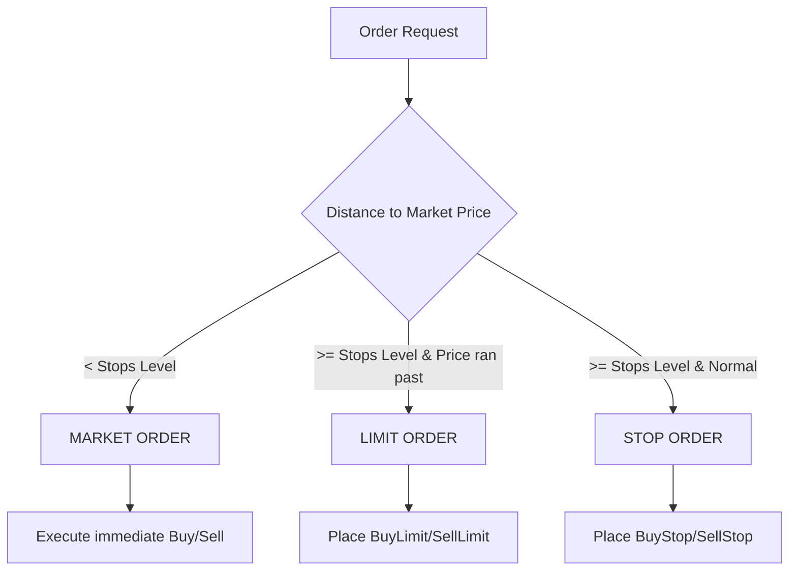

# MT5 Pending Order Stops-Level Wrapper (`PendingOrderWrapper.mqh`)

A robust, self-contained MQL5 module designed to solve the common broker trade rejection `[Invalid price]` (caused by violating the broker's minimum `SYMBOL_TRADE_STOPS_LEVEL` distance requirements) and completely prevent trade server retry flooding.

---

## 🔍 The Problem

When developing Expert Advisors (EAs) on volatile index CFDs (like NAS100, US30, GER30, SPX500) or high-spread currency pairs, brokers enforce a minimum distance (in points) between the current market price and any pending order or its SL/TP. This limit is known as the **Stops Level**.

If an EA tries to place a `Buy Stop` or `Sell Stop` order at a target level, but the market moves too fast (or spread widens) and the current price gets too close to that level:
1. The MT5 trade server **rejects** the order with `[Invalid price]`.
2. The EA's state machine fails to transition and immediately retries on the next tick, **flooding the terminal journal** with retry spam and risking **broker account suspension**.

---

## 🛠️ The Solution

The `CPendingOrderWrapper` class wraps all pending order requests and dynamically converts them in real-time into one of **three execution modes** depending on the broker's Stops Level constraints:



### 1. **Mode A: Market Order (Freeze Zone Execution)**
* **Condition**: Current price is closer than `Stops Level` points to the target entry price.
* **Action**: Executed immediately as a Market Order (`CTrade::Buy` or `CTrade::Sell`).
* **Benefit**: Ensures 100% execution when the price is extremely close to the breakout level instead of getting rejected. The SL/TP and Lot size are dynamically recalculated relative to the actual execution price.

### 2. **Mode B: Limit Order (Run-Away Zone Execution)**
* **Condition**: Current price has already run past the target entry price by at least `Stops Level` points.
* **Action**: Placed as a Pending Limit Order (`CTrade::BuyLimit` or `CTrade::SellLimit`) at the target entry price.
* **Benefit**: Guarantees we only enter at the desired breakout level on a subsequent retracement, preventing us from buying at a premium/top.

### 3. **Mode C: Stop Order (Normal Zone Execution)**
* **Condition**: Current price is far enough from the target entry price in the expected direction.
* **Action**: Placed as a standard Pending Stop Order (`CTrade::BuyStop` or `CTrade::SellStop`).

---

## 📦 API reference

```mql5
#include "PendingOrderWrapper.mqh"
```

### Class `CPendingOrderWrapper`

#### Public Methods:
- `void SetMagicNumber(int magic)`: Sets the EA's trade magic number.
- `bool BuyPending(...)`: Handles wrapping for Buy orders.
- `bool SellPending(...)`: Handles wrapping for Sell orders.

#### Method Parameters:
```mql5
bool BuyPending(double volume,              // Trade lot size
                double entryPrice,          // Desired entry breakout price
                string symbol,              // Symbol name (e.g. "NAS100.s")
                double sl,                  // Desired stop loss price
                double tp,                  // Desired take profit price
                ENUM_ORDER_TYPE_TIME type_time = ORDER_TIME_GTC, // Order GTC mode
                datetime expiration = 0,    // Expirations (if any)
                string comment = ""         // Order comment/tag
);
```

---

## 🚀 Integration Guide

Integrating this module into any existing EA takes only a few lines of code:

### Step 1: Declare the Wrapper
Include the header file and declare the wrapper instance at the top of your EA:
```mql5
#include <PendingOrderWrapper.mqh>

CPendingOrderWrapper g_orderWrapper;
```

### Step 2: Initialize
Set the magic number inside `OnInit()`:
```mql5
int OnInit()
{
   g_orderWrapper.SetMagicNumber(123456); // Set your magic number
   return(INIT_SUCCEEDED);
}
```

### Step 3: Replace standard `BuyStop` / `SellStop` calls
Replace your old direct order calls with `BuyPending` and `SellPending`:

**Old Code:**
```mql5
// Old direct placement (prone to [Invalid price] failure)
if(m_trade.BuyStop(lot, entryPrice, symbol, sl, tp, ORDER_TIME_GTC, 0, comment))
{
   m_state = EA_WAITING_FOR_FILL;
}
```

**New Code:**
```mql5
// New wrapped placement (100% robust, handles Stops Level dynamically)
if(g_orderWrapper.BuyPending(lot, entryPrice, symbol, sl, tp, ORDER_TIME_GTC, 0, comment))
{
   m_state = EA_WAITING_FOR_FILL;
}
else
{
   // Handle real failures gracefully (e.g., transition state to stop retries)
   m_state = EA_DONE;
   PrintFormat("ERROR: Trade submission failed. System will not spam the server.");
}
```
