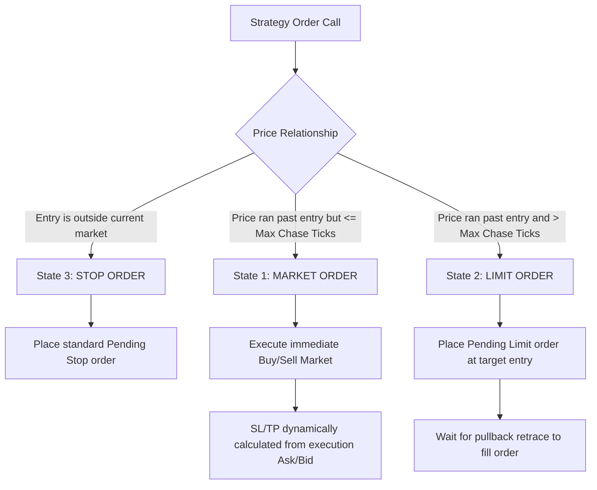

# Quantower Pending Order Stops-Level Wrapper (`PendingOrderWrapper.cs`)

A highly reusable, self-contained C# module for Quantower strategies designed to handle rapid market price fluctuations relative to target breakouts, preventing broker rejections (`[Invalid price]`) and tick-level order spamming.

---

## 🔍 The Problem

When executing breakout-retest strategies in highly volatile Futures markets (like NQ or ES index futures on Rithmic/CQG), standard stop pending orders have strict price relations:
* A **Buy Stop** must have its trigger price **above** the current market `Ask` price.
* A **Sell Stop** must have its trigger price **below** the current market `Bid` price.

If the market moves extremely fast, and the price crosses your target breakout level *before* the strategy successfully places the pending stop order, the Rithmic/exchange trade server will **reject** the order. If the strategy does not transition state, it will loop and attempt to place the order on every subsequent quote tick, leading to:
1. **Choking/retrying spam** (hundreds of failed requests in a few seconds).
2. Risk of **API rate-limiting or account suspension** by the broker/connection provider.

---

## 🛠️ The Solution

The `PendingOrderWrapper` class wraps all Quantower C# strategy pending order placements and automatically evaluates the current market conditions in real-time, executing one of **three distinct states** based on a user-defined **Max Chase Ticks** threshold:



### 1. **State 3: Stop Order (Normal Zone Execution)**
* **Condition**: The target `entryPrice` is at a normal distance ahead of the market price.
* **Action**: Places a standard pending `OrderType.Stop` order.

### 2. **State 1: Market Order (Chase Zone Execution)**
* **Condition**: The price has already run past your `entryPrice`, but by a very small margin (within `Max Chase Ticks` of slip).
* **Action**: Executes an immediate `OrderType.Market` order to get you filled on the breakout wave.
* **Important**: To protect your risk parameters, **Stop Loss and Take Profit levels are dynamically calculated from the current market Ask/Bid price** instead of the original entry price.

### 3. **State 2: Limit Order (Retrace Zone Execution)**
* **Condition**: The price has already run past your `entryPrice` by more than the `Max Chase Ticks` threshold. Chasing here would result in excessive slippage and poor R/R.
* **Action**: Places a pending `OrderType.Limit` order at the original `entryPrice` level.
* **Benefit**: Ensures we only enter at the premium breakout level if the price pulls back, protecting our risk profile.

---

## 📦 API Reference

```csharp
using TradingPlatform.BusinessLayer;
```

### Class `PendingOrderWrapper`

#### Constructor:
```csharp
public PendingOrderWrapper(Strategy strategy)
```
* Binds the wrapper to the calling strategy instance for standard logging and platform resource management.

#### Public Methods:
```csharp
public TradingOperationResult BuyPending(
    Account account,
    Symbol symbol,
    double lot,
    double entryPrice,
    int slTicks,
    int tpTicks,
    int maxChaseTicks,
    string comment,
    TimeInForce timeInForce = TimeInForce.GTC
);

public TradingOperationResult SellPending(
    Account account,
    Symbol symbol,
    double lot,
    double entryPrice,
    int slTicks,
    int tpTicks,
    int maxChaseTicks,
    string comment,
    TimeInForce timeInForce = TimeInForce.GTC
);
```

---

## 🚀 Integration Guide

Integrating this module into any existing Quantower C# strategy takes only a few lines of code:

### Step 1: Add parameter for Chase Ticks
Add the chase tick configuration to your strategy's `InputParameter` settings:
```csharp
[Category("Order Settings")]
[InputParameter("Max Chase Ticks for Market Order", 120)]
public int InpMaxChaseTicks = 10; // Default 10 ticks for NQ/ES chasing
```

### Step 2: Instantiate the wrapper
Declare and initialize the `PendingOrderWrapper` in your strategy:
```csharp
private PendingOrderWrapper orderWrapper;

protected override void OnCreated()
{
    base.OnCreated();
    this.orderWrapper = new PendingOrderWrapper(this);
}
```

### Step 3: Replace standard `PlaceOrder` calls
Replace old direct order placements with wrapped execution calls:

**Old Direct Placement (Vulnerable to [Invalid price] and spamming):**
```csharp
var request = new PlaceOrderRequestParameters
{
    Account = this.CurrentAccount,
    Symbol = this.CurrentSymbol,
    Side = Side.Buy,
    OrderTypeId = OrderType.Stop,
    Quantity = lot,
    Price = entryPrice,
    TriggerPrice = entryPrice,
    StopLoss = SlTpHolder.CreateSL(sl, PriceMeasurement.Absolute),
    TakeProfit = SlTpHolder.CreateTP(tp, PriceMeasurement.Absolute),
    Comment = "MyBreakoutTag",
    TimeInForce = TimeInForce.GTC
};

var result = Core.Instance.PlaceOrder(request);
```

**New Wrapped Placement (100% Robust, Adaptive 3-States):**
```csharp
var result = this.orderWrapper.BuyPending(
    account: this.CurrentAccount,
    symbol: this.CurrentSymbol,
    lot: lot,
    entryPrice: entryPrice,
    slTicks: this.InpSlTicks,
    tpTicks: this.InpTpTicks,
    maxChaseTicks: this.InpMaxChaseTicks,
    comment: "MyBreakoutTag"
);

if (result.Status == TradingOperationResultStatus.Success)
{
    this.State = MyState.WAITING_FOR_ENTRY;
}
else
{
    // Gracefully transition state on real broker rejection to stop retry spamming
    this.State = MyState.DONE;
    this.Log($"Order Placement Failed: {result.Message}", StrategyLoggingLevel.Error);
}
```
